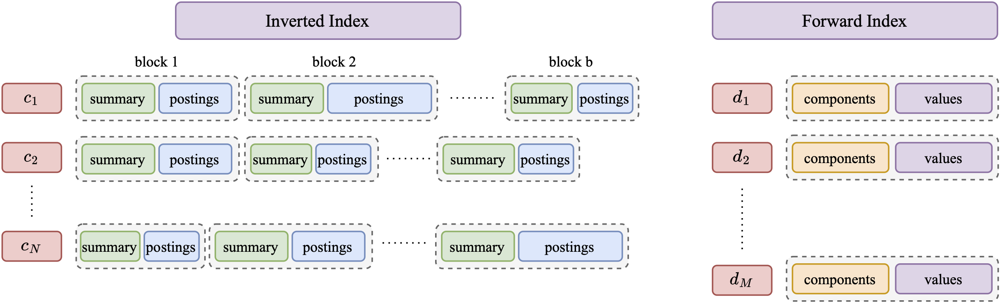

<p align="center">
    
    <h1 align="center">Seismic</h1>
</p>

<p align="center">
    <a href="-"></a>
    <a href="http://arxiv.org/abs/2404.18812"></a>
</p>

<p align="center">    
    <a href="https://crates.io/crates/seismic"></a>
    <a href="https://crates.io/crates/seismic"></a>
    <a href="LICENSE.md"></a>
</p>

Seismic is designed for effective and efficient retrieval over *learned sparse embeddings*.
Pleasantly, the design uses in a new way two familiar data structures: the inverted and the forward index.
The approach organizes inverted lists into geometrically-cohesive blocks.
Each block is equipped with a sketch, serving as a summary of the vectors contained in it. The summaries allow us to skip over a large number of blocks during retrieval and save substantial compute. When a summary indicates that a block must be examined, we use the forward index to retrieve exact embeddings of its documents and compute inner products.

The figure below gives an overview of the overall design.

<p align="center">
  
</p>

Experimental results show that single-threaded query processing using Seismic, reaches sub-millisecond per-query latency on various sparse embeddings of the MSMarco dataset while maintaining high recall. The results indicate that Seismic is one to two orders of magnitude faster than state-of-the-art inverted index-based solutions and further outperforms the winning (graph-based) submissions to the BigANN Challenge by a significant margin.

See the paper [[1](#bib)] for more details.


## Experimental Results
We report here a comparison with other state-of-the-art indexes for sparse vectors. See the paper [[1](#bib)] for more detailed experimental evaluation.


<p align="center">
  
</p>

### How to Replicate the Experiments

To run the experiments with Seismic, we need to compile the binary executables using:

```bash
RUSTFLAGS="-C target-cpu=native" cargo build --release
```

This command produces three executables: `build_inverted_index`, `perf_inverted_index`, and `generate_groundtruth` in the `/target/release/` directory.

The `build_inverted_index` executable is used to construct an inverted index for a dataset. Both dataset and query files are stored in an internal binary format. Refer to the [Python scripts](#scripts) section for a script to convert a dataset from JSON format. This process involves several parameters that regulate space/time trade-offs:

- `--n-postings`: Regulates the size of the posting list, representing the average number of postings stored per posting list.
- `--summary-energy`: Controls the size of the summaries, preserving a fraction of the overall energy for each summary.
- `--centroid-fraction`: Determines the number of centroids built for each posting list, capped at a fraction of the posting list length.

For Splade on MSMarco, good choices are `--n-postings 3500`, `--summary-energy 0.4`, and `--centroid-fraction 0.1`.

The following command can be used to create a Seismic index serialized in the file `splade.bin.3500.seismic`:

```bash
./target/release/build_inverted_index -i splade.bin -o splade.bin.3500_0.4_0.1 --centroid-fraction 0.1 --summary-energy 0.4 --n-postings 3500 
```

To execute a set of queries, use the `perf_inverted_index` executable. Two parameters, `query-cut` and `heap-factor`, trade-off efficiency vs accuracy:

- `--query-cut`: The search algorithm considers only the top `query_cut` components of the query.
- `--heap-factor`: The search algorithm skips a block whose estimated dot product is greater than `heap_factor` times the smallest dot product of the top-k results in the current heap.

The following command exemplifies this:

```bash
./target/release/perf_inverted_index -i splade.bin.3500_0.4_0.1c -q splade_queries.bin -o results.tsv --query-cut 5 --heap-factor 0.7
```

The dataset of queries is in binary internal format. Refer again to the [Python scripts](#scripts) section for a script to convert a dataset from JSON format.

The executable prints the average running time per query. Queries are executed in single-thread mode. To enable multithreading, modify the Rust code by replacing the iteration on the query from `queries.iter().take(n_queries).enumerate()` to `queries.par_iter().take(n_queries).enumerate()`.

The results are written in the file `results.tsv`. For each query, there are `k` lines, one for each of its results. Each line follows this format:

```text
query_id\tdocument_id\tresult_rank\tdot_product
```

Here, `query_id` is a progressive identifier for the query, `document_id` is the identifier of the document in the indexed dataset, and `result_rank` indicates their rank in the ordering by their `dot_product` with the query.

To evaluate the accuracy of the retrieved results against an already computed ground truth, use the Python script `scripts/accuracy.py`:

```bash
python3 scripts/accuracy.py groundtruth.tsv results.tsv
```

This will output the recall percentage.

The ground truth for a dataset can be computed with `generate_groundtruth` as follows:

```bash
./target/release/generate_groundtruth -i splade.bin -q splade_queries.bin -o groundtruth.tsv
```

The exact top-10 results of each query are written in the file `groundtruth.tsv` with the format described above.

Even if multithreading is enabled here, the execution may take a considerable amount of time due to the brute-force exact query algorithm that scans the entire dataset for each query.


### <a name="parameters">Seismic Parameters</a>

The table below reports the building parameters we used for the different datasets.
 
| Dataset | `--n-postings` | `--centroid-fraction` |`--summary-energy` |
|-----------------|-----------------:|-----------------:|----------------:|
| MSMARCO-Splade  | 4000    | 0.1    | 0.4    |
| MSMARCO-Effsplade | 4000 | 0.1 | 0.4 |
| MSMARCO-UniCOIL-T5 | 4000 |  0.1 | 0.4 |
| NQ-Splade | 3500 | 0.15 | 0.5 |


The table below reports the query parameters we used for the different datasets and various levels of accuracy.

Results may change slightly if you re-create the indexes, due to the random selection of the centroids of Seismic. 

**Splade on MSMARCO**
|   $hf$ |   $q_c$ |   Time \[ $\mu s$ \] |   Accuracy@10 |
|-----------------|-----------------:|-----------------:|----------------:|
|           0.9 |           3 |    187 |    90.49 |
|           0.9 |           4 |    206 |    92.27 |
|           0.9 |           4 |    206 |    92.27 |
|           0.9 |           5 |    222 |    93.13 |
|           0.9 |           8 |    269 |    94.07 |
|           0.8 |           5 |    303 |    95.69 |
|           0.8 |           6 |    348 |    96.11 |
|           0.7 |           6 |    531 |    97.17 |


**E-Splade on MSMARCO**
|   $hf$ |   $q_c$ |   Time \[ $\mu s $\] |   Accuracy@10 |
|-----------------|-----------------:|-----------------:|----------------:|
|           1   |           3 |    222 |    90.99 |
|           1   |           4 |    222 |    90.99 |
|           1   |           4 |    239 |    93.26 |
|           1   |           4 |    239 |    93.26 |
|           1   |           6 |    256 |    94.17 |
|           0.9 |           4 |    376 |    95.95 |
|           0.9 |           5 |    383 |    96.53 |
|           0.8 |           5 |    581 |    97.47 |

**Unicoil-T5 on MSMARCO**

|   $hf$ |   $q_c$ |   Time \[ $\mu s$ \] |   Accuracy@10 |
|-----------------|-----------------:|-----------------:|----------------:|
|           1   |           3 |    115 |    90.04 |
|           1   |           4 |    123 |    91.33 |
|           1   |           6 |    133 |    92.07 |
|           0.9   |           3 |    168 |    94.03 |
|           0.9   |           3 |    168 |    94.03 |
|           0.9 |           4 |    180 |    95.13 |
|           0.8 |           4 |    268 |    96.76 |
|           0.8 |           5 |    280 |    97.19 |

**NQ on MSMARCO**
|   $hf$ |   $q_c$ |   Time \[ $\mu s$ \] |   Accuracy@10 |
|-----------------|-----------------:|-----------------:|----------------:|
|           1   |           3 |    195 |    91.25 |
|           1   |           4 |    195 |    91.25 |
|           1   |           6 |    211 |    92.23 |
|           0.9   |           3 |    240 |    93.24 |
|           0.9   |           3 |    266 |    95.17 |
|           0.9 |           4 |    266 |    95.17    |
|           0.8 |           4 |    286 |    96.26 |
|           0.8 |           5 |    362 |    97.18 |


We provide a script to explore the search parameters given a trained index; the script is `scripts/grid_search_only_accuracy.sh`. You can use it as follows:

```bash
index_path=""
results_file_path=""
queries_path=""
gt_path=""

bash scripts/grid_search_only_accuracy.sh $index_path $results_file_path $queries_path $gt_path
```

The script writes the result of the grid search in `results_file_path`. To get the fastest configuration at each accuracy cut, simply run

```bash
python scripts/extract_results.py --file-path $results_file_path
```

## <a name="scripts">Python Scripts</a>

### Download the Datasets

The embeddings in ```jsonl```  format used in our experiments can be downloaded from this HugginFace [repository](https://huggingface.co/collections/tuskanny/seismic-datasets-6610108d39c0f2299f20fc9b), together with the queries representations. 

As an example, the <span style="font-variant:small-caps;">Splade</span> embeddings for <span style="font-variant:small-caps;">MsMarco</span> can be downloaded and extracted by runnning the following commands.

```bash
wget https://huggingface.co/datasets/tuskanny/seismic-msmarco-splade/resolve/main/documents.tar.gz?download=true -O documents.tar.gz 

tar -xvzf documents.tar.gz
```

or by using the Huggingface dataset download [tool](https://huggingface.co/docs/hub/en/datasets-downloading).

### Convert the Data

Documents and queries should have the following format. Each line should be a JSON-formatted string with the following fields:
- `id`: must represent the ID of the document as an integer.
- `content`: the original content of the document, as a string. This field is optional. 
- `vector`: a dictionary where each key represents a token, and its corresponding value is the score, e.g., `{"dog": 2.45}`.

This is the standard output format of several libraries to train sparse models, such as [`learned-sparse-retrieval`](https://github.com/thongnt99/learned-sparse-retrieval).

The script ```convert_json_to_inner_format.py``` allows converting files formatted accordingly into the ```seismic``` inner format.

```bash
python scripts/convert_json_to_inner_format.py --document-path /path/to/document.jsonl --queries-path /path/to/queries.jsonl --output-dir /path/to/output 
```
This will generate a ```data``` directory at the ```/path/to/output``` path, with ```documents.bin``` and ```queries.bin``` binary files inside.

If you download the NQ dataset from the HuggingFace repo, you need to specify ```--input-format nq``` as it uses a slightly different format. 

## <a name="code">Using the Rust Code</a>

To incorporate the Seismic library into your Rust project, navigate to your project directory and run the following Cargo command:

```bash
cargo add seismic
```

This command adds the Seismic library to your project.

#### Creating a Toy Dataset

Let's create a toy dataset comprising vectors with `f32` values. Next, we'll convert this dataset to use half-precision floating points ([`half::f16`](https://docs.rs/half/latest/half/)). Finally, we'll check the number of vectors, the dimensionality, and the number of non-zero components of the dataset.

```rust
use seismic::SparseDataset;
use half::f16;

let data = vec![
                (vec![0, 2, 4],    vec![1.0, 2.0, 3.0]),
                (vec![1, 3],       vec![4.0, 5.0]),
                (vec![0, 1, 2, 3], vec![1.0, 2.0, 3.0, 4.0])
                ];

let dataset: SparseDataset<f16> = data.into_iter().collect::<SparseDataset<f32>>().into();

assert_eq!(dataset.len(), 3);  // Number of vectors  
assert_eq!(dataset.dim(), 5);  // Number of components
assert_eq!(dataset.nnz(), 9);  // Number of non zero components
```

The following code shows how to read a dataset in the internal binary format with `f32` values and quantize those values to `f16`. 

```rust,ignore
let dataset = SparseDataset::<f32>::read_bin_file(&input_filename).unwrap().quantize_f16();
```

#### Building and Querying an Index

Let's build an index using the above toy dataset and search for a query.

```rust
use seismic::inverted_index::{Configuration,InvertedIndex};
use seismic::SparseDataset;

use half::f16;

let data = vec![
                (vec![0, 2, 4],    vec![1.0, 2.0, 3.0]),
                (vec![1, 3],       vec![4.0, 5.0]),
                (vec![0, 1, 2, 3], vec![1.0, 2.0, 3.0, 4.0])
                ];

let dataset: SparseDataset<f16> = data.into_iter().collect::<SparseDataset<f32>>().into();

let inverted_index = InvertedIndex::build(dataset, Configuration::default());

let result = inverted_index.search(&vec![0, 1], &vec![1.0, 2.0], 1, 5, 0.7);

assert_eq!(result[0].0, 8.0);
assert_eq!(result[0].1, 1);
```

There are building configuration parameters to experiment with. Take a look at [build_inverted_index.rs](src/bin/build_inverted_index.rs) code for an example. 

The most important ones are

- `n_postings` in `PruningStrategy::GlobalThreshold`: Regulates the size of the posting list, representing the average number of postings stored per posting list.
- `summary_energy` in `SummarizationStrategy::EnergyPerserving`: Controls the size of the summaries, preserving a fraction of the overall energy for each summary.
- `centroid_fraction` in `BlockingStrategy::RandomKmeans`: Determines the number of centroids built for each posting list, capped at a fraction of the posting list length.

Refer to [Seismic parameters](#parameters) for recommended values for different datasets.

Take a look at [build_inverted_index.rs](src/bin/build_inverted_index.rs) and [perf_inverted_index.rs](src/bin/perf_inverted_index.rs) for examples to serialize/deserialize an index on a file.  

The signature of the `search` method is 

```rust,ignore
pub fn search(
        &self,
        query_components: &[u16],
        query_values: &[f32],
        k: usize,
        query_cut: usize,
        heap_factor: f32,
    ) -> Vec<(f32, usize)>
```

It accepts a sparse vector for the query (`query_components` and `query_values`), `k` for top-`k` results, and parameters `query_cut` and `heap_factor` for trade-off between accuracy and query time.

- `query_cut`: The search algorithm considers only the top `query_cut` components of the query.
- `heap_factor`: The search algorithm skips a block whose estimated dot product is greater than `heap_factor` times the smallest dot product of the top-k results in the current heap.

Refer to [Seismic parameters](#parameters) for their influence on recall and query time on the different datasets. 

## <a name="code">Using the Python Interface</a>

We have also included a Python interface for convenience.
It is fairly straightforward to build the Python interface with `maturin` as follows:

```bash
pip install maturin
RUSTFLAGS="-C target-cpu=native" maturin build -r
for whl in target/wheels/*.whl; do pip3 install $whl; done
```

Confirm that the installation was successful by importing `seismic`,
building an index, and querying it:

```python
from seismic import PySeismicIndex

# We assume that the sparse dataset is in the internal format.
index = PySeismicIndex.build(
    input_file,
    n_postings=3500,
    centroid_fraction=0.1,
    truncated_kmeans_training=False,
    truncation_size=16,
    min_cluster_size=2,
    summary_energy=0.4)
    
# You can serialize and store the index in a file.
index.save(index_path)

# You may later load the index to query it.
index = PySeismicIndex.load(index_path)

# Search can be done either for a single query. 
results: List[Tuple[float, int]] = index.search(
    query_components=np.array([...], dtype=np.int32),
    query_values=np.array([...], dtype=np.float32),
    k, query_cut, heap_factor)

# You may also (concurrently) search the index with a batch of
# queries. Assuming the queries are stored in the internal format,
# you can invoke the following function:

results: List[List[Tuple[float, int]]] = index.batch_search(
    query_path, k, query_cut, heap_factor, num_threads)
```

## <a name="bib">Bibliography</a>
1. Sebastian Bruch, Franco Maria Nardini, Cosimo Rulli, Rossano Venturini. "*Efficient Inverted Indexes for Approximate Retrieval over Learned Sparse Representations*." In ACM SIGIR. 2024. 

## Citation License

The source code in this repository is subject to the following citation license:

By downloading and using this software, you agree to cite the under-noted paper in any kind of material you produce where it was used to conduct a search or experimentation, whether be it a research paper, dissertation, article, poster, presentation, or documentation. By using this software, you have agreed to the citation license.

```bibtex
@inproceedings{Seismic,
  author    = {Sebastian Bruch and Franco Maria Nardini and Cosimo Rulli and Rossano Venturini},
  title     = {Efficient Inverted Indexes for Approximate Retrieval over Learned Sparse Representations},
  booktitle = {The 47th International {ACM} {SIGIR} {onference on Research and Development in Information Retrieval ({SIGIR})},
  pages     = {152--162},
  publisher = {{ACM}},
  year      = {2024},
  url       = {https://doi.org/10.1145/3626772.3657769},
  doi       = {10.1145/3626772.3657769},
}
```
